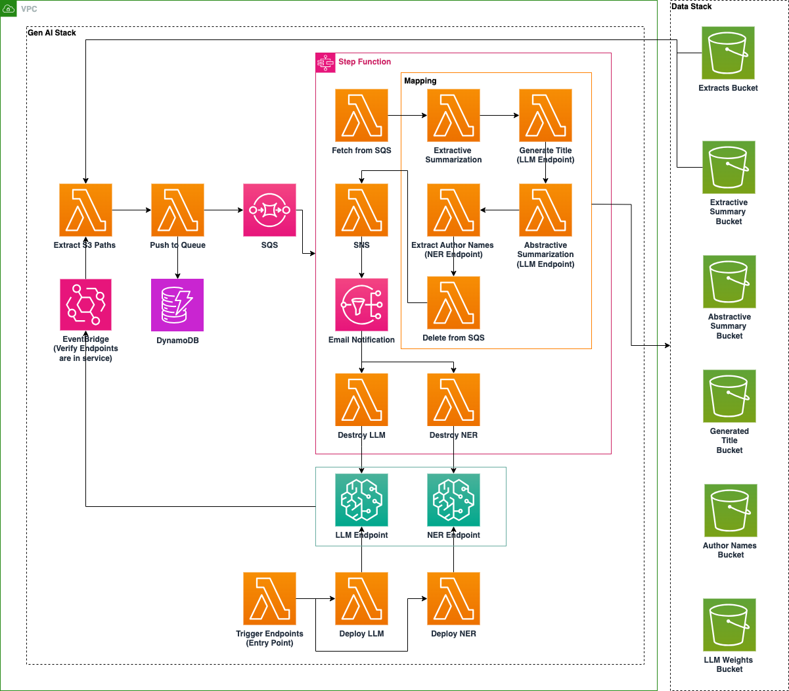
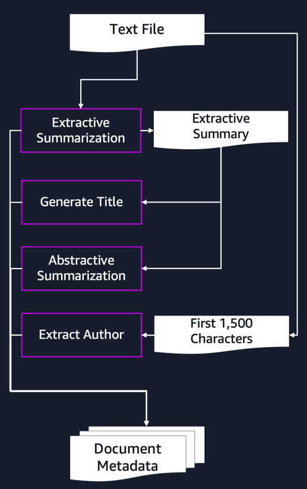

# NER & LLM Gen AI Application Documentation

## Introduction

The NER & LLM Gen AI Application represents a sophisticated, serverless document processing solution built on Amazon Web Services (AWS). This enterprise-grade system combines Named Entity Recognition (NER) and Large Language Models (LLM) to automate document analysis, information extraction, and content summarization at scale.

In today's data-driven environment, organizations face the challenge of processing vast amounts of textual information efficiently. Traditional methods of manual document processing are time-consuming, inconsistent, and don't scale well. This application addresses these challenges by leveraging state-of-the-art language models: Mixtral-8x7B for intelligent text generation and summarization, and a Bert NER model for precise entity recognition.

# Table of Contents

1. [Architecture](#architecture)
    - [System Overview](#system-overview)

2. [Project Structure](#project-structure)
    - [Core Processing Flow](#core-processing-flow)
    - [Infrastructure](#infrastructure)

3. [Technical Details](#technical-details)
    - [Named Entity Recognition](#named-entity-recognition)
    - [Summarization Approaches](#summarization-approaches)

4. [Setup and Deployment](#setup-and-deployment)
    - [Prerequisites](#prerequisites)
    - [Model Preparation](#model-preparation)
    - [Deployment Guide](#deployment-guide)

5. [Usage Guide](#usage-guide)
    - [Getting Started](#getting-started)
    - [Accessing Results](#accessing-results)
    - [Processing Validation](#processing-validation)
6. [Authors and Reviewers](#authors-and-reviewers)


## Architecture

### System Overview

The application implements a serverless architecture with sagemaker endpoints that automatically deploys and destroys after use. This architecture balances processing power, cost efficiency, and scalability. Each component is designed to handle specific aspects of the document processing workflow while maintaining loose coupling for flexibility and resilience.

## Project Structure

The application follows a modular, maintainable architecture with clear separation of concerns:
```
    .
    ├── cfn_templates/              # Cloudformation templates 
    │   ├── data.yaml               # Storage and database resources
    │   └── sm_gen_ai.yaml          # ML infrastructure components
    ├── functions/                   
    │   ├── genai/                  # AI processing functions
    │   │   ├── abstractive_summarization/
    │   │   ├── author_extraction/
    │   │   ├── extractive_summarization/
    │   │   └── generated_title/
    │   └── shared/                 # Infrastructure functions
    │       ├── create_sagemaker_endpoint/
    │       ├── delete_sagemaker_endpoint/
    │       ├── extract_paths_in_s3/
    │       ├── push_to_queue/
    │       ├── sns/
    │       ├── sqs_batch_receive/
    │       └── trigger_endpoints/
    ├── notebooks/                   # Model preparation notebooks
    ├── statemachines/              # Processing workflow definitions
    └── template.yaml               # Main AWS SAM template
```

Each component serves a specific purpose in the processing pipeline:

The `genai/` directory contains the core AI processing functions:
- extractive_summarization: Creates initial summaries using key sentence extraction
- abstractive_summarization: Generates fluent, contextual summaries using the LLM from the extractive summary
- author_extraction: Identifies and extracts author information using NER
- generated_title: Produces document titles based on extractive summary

The `shared/` directory houses infrastructure management functions:
- create_sagemaker_endpoint: Initializes ML model endpoints
- delete_sagemaker_endpoint: Cleans up resources after processing
- extract_paths_in_s3: Manages document discovery and tracking
- push_to_queue: Handles document processing queue
- sns: Manages notifications
- sqs_batch_receive: Coordinates batch processing
- trigger_endpoints: Initiates processing pipeline

#### Core Processing Flow

When a document enters the system, it triggers a carefully orchestrated sequence of events:

1. **Application Trigger**: The application compares the contents of the extracts bucket against the extractive summary bucket to identify unprocessed files. This approach ensures efficient processing by:
   - Preventing redundant processing of already analyzed documents
   - Enabling batch processing for improved efficiency
   - Maintaining processing state across system restarts

2. **Model Endpoint Management**: The system employs a dynamic approach to model endpoint management:
   - Endpoints are created only when needed, reducing costs
   - Multiple documents are processed in batches while endpoints are active
   - Automatic deletion of endpoints occurs after processing completes

3. **Document Processing**: Each document undergoes multiple processing stages:
   - Parallel processing where appropriate
   - Sequential processing for dependent operations
   - Separation of results in storage

### Infrastructure

The infrastructure implements a secure, scalable foundation for document processing through multiple specialized components:

#### Storage Architecture

The multi-bucket S3 strategy serves specific purposes in the processing pipeline:

| Bucket Type | Purpose                 | 
|-------------|-------------------------|
| Extracts | Source documents        |
| Extractive Summary | Key sentence summaries  |
| Abstractive Summary | LLM generated summaries |
| Generated Titles | Document titles         | 
| Author Information | Extracted metadata      |

#### Logical Diagram


#### Processing Components

Each Lambda function serves a specific purpose in the processing pipeline:

**AI Processing Functions:**

1. Extractive Summarization
   - Purpose: Creates initial summary using key sentence extraction
   - Input: Raw document text
   - Processing: Implements TextRank or Luhn algorithm
   - Output: Condensed document with key sentences

2. Abstractive Summarization
   - Purpose: Generates natural language summary
   - Input: Extractive summary, removing low impact sentences improves compute time and cost
   - Processing: Uses LLM for coherent text generation
   - Output: Fluent, contextual summary

3. Title Generation
   - Purpose: Creates contextual document titles
   - Input: Extractive summary, removing low impact sentences improves compute time and cost
   - Processing: LLM-based title generation
   - Output: Descriptive title

4. Author Extraction
   - Purpose: Identifies document authors
   - Input: Original document text (first 1500 characters - estimated first page of the document)
   - Processing: NER-based name identification
   - Output: Structured author information

Example Processing Chain:
1. Original Document (Extracts Bucket):
   > "Q3 Financial Report, prepared by John Smith and Sarah Johnson. The company experienced significant growth..."

2. Extractive Summary:
   > "The company experienced significant growth. Revenue increased by 45%. Market share expanded in key regions." (Retain sentences of high importance)

3. Abstractive Summary:
   > "The organization demonstrated exceptional performance in Q3, with substantial revenue growth and market expansion." (From extractive summary)

4. Generated Title:
   > "Q3 2024 Financial Performance Analysis" (From extractive summary)

5. Author Information:
    <blockquote> 
    "John Smith" (From first 1,500 characters)
   
    "Sarah Johnson" (From first 1,500 characters)
    </blockquote>


**Customization and Extensibility**

The provided Lambda functions serve as examples of document processing capabilities, but they are designed with extensibility in mind. Each function demonstrates a particular use case but these implementations represent what's possible with this architecture.

Organizations can easily modify these functions to meet their specific document processing requirements. For instance, the abstractive summarization prompt could be adjusted to generate executive summaries, technical abstracts, or marketing copy. The NER model could extract other entities not just people/author. The extractive summarization algorithm could be modified to prioritize different types of content based on domain-specific rules or alternative summarization techniques.

**Helper Lambda Functions:**

1. Document Discovery and Queue Management
   - Extract Paths in S3
     - Purpose: Manages document discovery and initiates processing
     - Behavior: Compares contents between extracts and extractive summary buckets to identify new documents
     - Integration: Triggers the Push to Queue function for newly identified documents

   - Push to Queue
     - Purpose: Manages document processing queue
     - Behavior: Adds documents to SQS queue and updates DynamoDB with document status
     - Integration: Interfaces with SQS and DynamoDB for reliable message handling and state management

2. SageMaker Endpoint Management
   - Create SageMaker Endpoint (LLM)
     - Purpose: Initializes the Large Language Model endpoint
     - Behavior: Creates SageMaker endpoint for LLM using specified configurations
     - Integration: Interfaces with SageMaker API to manage model deployments

   - Create SageMaker Endpoint (NER)
     - Purpose: Initializes the Named Entity Recognition model endpoint
     - Behavior: Creates SageMaker endpoint for NER using specified configurations
     - Integration: Interfaces with SageMaker API to manage model deployments

   - Delete SageMaker Endpoint (LLM)
     - Purpose: Cleans up LLM resources after processing
     - Behavior: Deletes the LLM SageMaker endpoint and associated resources. Sends an e-mail notification regarding endpoint deletion ensuring awareness that the endpoint is not persistent after the job completion.
     - Integration: Interfaces with SageMaker API and sends notifications via SNS

   - Delete SageMaker Endpoint (NER)
     - Purpose: Cleans up NER resources after processing
     - Behavior: Deletes the NER SageMaker endpoint and associated resources. Sends an e-mail notification regarding endpoint deletion ensuring awareness that the endpoint is not persistent after the job completion.
     - Integration: Interfaces with SageMaker API and sends notifications via SNS

3. Processing Coordination
   - SQS Batch Receive
     - Purpose: Retrieves batches of messages from SQS for processing
     - Behavior: Fetches messages from SQS queue with specified batch size
     - Integration: Interfaces with SQS and provides input for Step Functions

   - SNS (Job Complete)
     - Purpose: Notifies users of job completion
     - Behavior: Sends notification when all documents are processed
     - Integration: Uses SNS to deliver email notifications

   - Trigger Endpoints
     - Purpose: Initiates the creation of ML model endpoints
     - Behavior: Invokes Lambda functions to create LLM and NER endpoints
     - Integration: Coordinates with endpoint creation functions to start processing

## Technical Details
### Named Entity Recognition

Our NER implementation uses a Bert NER model to identify and classify named entities within documents. The system focuses particularly on author detection, examining the first 1,500 characters of each document where author information typically appears.

The NER process follows a sequence:

1. Token Detection identifies potential name components with confidence scoring
2. Name Assembly combines related tokens into full names
3. Validation confirms proper formatting and eliminates false positives

For example, processing the text:
> "Authored by Jane Smith"

Produces the below results:

| Processing Stage | Output | 
|-----------------|--------|
| Initial Detection | ["Jane", "Smith"] |
| Assembly | "Jane Smith" | 

Below are the entities Bert NER can detect:

| Tag    | Description                                                        |
|--------|-----------------------------------------------------------------|
| O      | Outside of a named entity                                         |
| B-MISC | Beginning of a miscellaneous entity right after another misc      |
| B-PER  | Beginning of a person's name right after another person's name    |
| B-ORG  | Beginning of an organization right after another organization     |
| B-LOC  | Beginning of a location right after another location              |
| I-MISC | Miscellaneous entity                                             |
| I-PER  | Person's name                                                     |
| I-ORG  | Organization                                                      |
| I-LOC  | Location                                                         |


### Summarization Approaches

The system implements both extractive and abstractive summarization techniques. Extractive summarization, powered by sumy and NLTK, functions like a skilled editor selecting key sentences from the original text. It employs the TextRank algorithm, treating sentences as nodes in a graph and determining importance based on their interconnections.

Abstractive summarization, utilizing the Mixtral-8x7B model, generates entirely new text that captures the document's essential meaning. This approach enables paraphrasing, information restructuring, and concept combination for more natural summaries.

Consider this example:

**Original Text:**
> "The company reported revenue growth of 12% in Q1 2024. Operating expenses increased by 5%. Net profit margins expanded to 15%. The board approved a new share buyback program..."

**Extractive Summary:**
> "The company reported revenue growth of 12% in Q1 2024. Net profit margins expanded to 15%."

**Abstractive Summary:**
> "The company demonstrated strong financial performance in Q1 2024, with double-digit revenue growth and improved profitability."

## Setup and Deployment

### Prerequisites

Before deploying the application, ensure your environment and AWS account are properly configured. This section details the requirements and preparation steps for successful deployment.

#### Regions
This application was tested on the following AWS regions:

| Partition  |  Region |
|------------|-----------------|
| Commercial | us-east-1 |
| GovCloud   | us-gov-west-1 |

#### Environment Requirements

A proper development environment requires:

1. Local Development Setup
   * Python 3.11 or later
   * AWS SAM CLI for infrastructure deployment
   * AWS CLI v2 for AWS interaction

2. AWS Account 
   * Service quota increase for ml.p4d.24xlarge instance
   * Sagemaker Domain/Notebook instance to download the models (optional)

### Model Preparation
1. [Huggingface security token token](https://huggingface.co/docs/hub/en/security-tokens)
2. Request model access for [Mixtral-8x7B-Instruct-v0.1](https://huggingface.co/mistralai/Mixtral-8x7B-Instruct-v0.1)
3. Grab the model bucket name from S3 which will be in this pattern: [aws-account-num]-[region]-[environment (default is `dev`)]-model-weights-[random string])
4. The application requires two primary models: Mixtral-8x7B for text generation and BERT-NER for entity recognition. These models are prepared using the provided Jupyter notebook in the `notebooks` directory which can be executed in a SageMaker Domain, Notebook instance or your local machine. Its output are .tar.gz files and will be uploaded in the models bucket. Ensure that you have write access to the bucket.
**Note: Mixtral model is 140+ GB**

```
ModelsBucket/
├── llm-model.tar.gz     # Mixtral model
└── ner-model.tar.gz     # BERT-NER model
```

### Deployment Guide

#### Initial Setup

1. Clone the Repository:
```
git clone <repository-url>
```

2. Go to the directory
```
cd <project-directory>
```
3. Download nltk files
```
bash download_punkt.sh      
```
4. Configure AWS Credentials:
* Ensure AWS CLI is configured with appropriate credentials
* Verify access to required services
* Check service quotas

#### Deployment Steps

1. Build Application:
```
sam build
```

2. Deploy Infrastructure:
```
sam deploy --parameter-overrides NotificationEmail=email@domain.com
```
Note: email provided will be sent a message regarding verification during deployment and job completion. 

#### Destroy/Delete application from AWS account
```
sam destroy
```

## Usage Guide

### Getting Started

#### Document Preparation

Before uploading documents, ensure they meet these requirements:
* Format: Plain text (.txt)
* Encoding: UTF-8
* Content: Raw text (For other types of files like PDFs/Images consider using AWS Textract first)

#### Document Processing

1. Upload Documents by navigate to your extracts bucket in the S3 AWS Console:
2. Find the trigger_endpoints function in Lambda console and execute the function
3. Processing Stages:
   * Create required SageMaker endpoints
   * Get documents in extracts bucket that is not in the extractive summary bucket to determine which files needs to be processed.
   * Process documents in parallel
   * Generate all outputs
   * Clean up endpoints
   * Send completion notification

#### Accessing Results

Results are organized in separate buckets:
  * Extractive summaries: {ExtractiveSummaryBucket}/{original_filename}
  * Abstractive summaries: {AbstractiveSummaryBucket}/{original_filename}
  * Generated titles: {GeneratedTitleBucket}/{original_filename}
  * Author information: {AuthorExtractionBucket}/{original_filename}

Example Output Structure:
```
ExtractiveSummaryBucket/
└── filename.txt       # Key sentences from document

AbstractiveSummaryBucket/
└── filename.txt       # Fluent summary

GeneratedTitleBucket/
└── filename.txt       # Generated title

AuthorExtractionBucket/
└── filename.txt       # Extracted author names
```

#### Processing Validation

1. Email Notification:
   * Receive completion notification
   * Indicates endpoint cleanup

2. Results Verification:
   * Check each output bucket
   * Verify file contents

## Authors and Reviewers
 * Nick Biso, Machine Learning Engineer - Amazon Web Services Inc.
 * Ian Lunsford, Aerospace Engineer - Amazon Web Services Inc.
 * Max Rathmann, Senior DevOps Engineer - Amazon Web Services Inc.
 * Jeff Ryan, DevOps Engineer - Amazon Web Services Inc.
 * Michael Massey, Cloud Application Architect - Amazon Web Services Inc.
 * Brian Weston, Cloud Transformation for Mission Science Program Lead - LLNL
 * Samson Odock, Security Engineer - Amazon Web Services Inc.
 * Kyle Rose, Data Scientist - Amazon Web Services Inc.